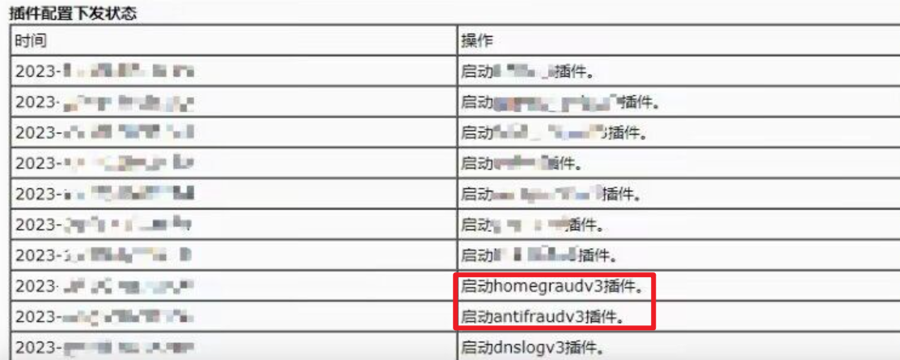
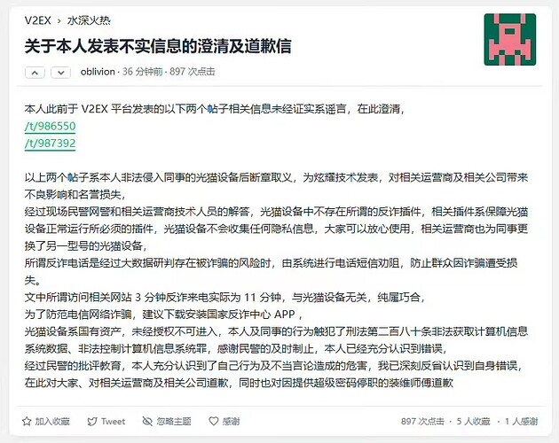
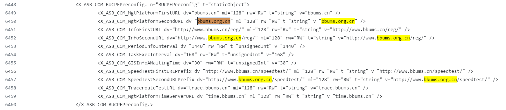

国内路由器内置监听软件
===================

最近国内官方监听软件越来越多了：拼多多后门、反诈 App、华为网络设备合法监听、路由器反诈插件。

2014 年之前，中国大陆还能自由访问 Google，不过短短十年，从最开始网络访问受限，到推广反诈监听App，再到国内所有国产手机系统内置反诈 App；如今已经开始家家户户的路由器安装监听软件，而大家却已经习惯充满监听的日常生活，不禁想起 肖申克的救赎 里的一句话：

> These walls are funny. First you hate 'em, then you get used to 'em. Enough time passes, you get so you depend on them. That's institutionalized.
>
> 监狱里的高墙，刚入狱的时候，你痛恨周围的高墙；慢慢地，你习惯了生活在其中；最终你会发现自己离开它就无法生存了。 ----《肖申克的救赎》

现在，国内甚至有人开始赞美高墙，认为是高墙保护了墙内的人民，于是打算记录一下现实生活中：反对高墙、习惯高墙、离不开高墙、赞美高墙的故事。

 

## 手机监听软件

- 2022年1月 月初，[MIUI](https://ggame.gledos.science/company/小米/MIUI.html#没有内置国家监控中心app) （小米）自称与国家反诈骗中心合作。

- 2022年1月16日，有用户发现 vivo 手机的安全管家里有「防骗中心」功能。

- 2023年1月16日，有位 Realme GT Neo3RMX3562 用户将手机更新到了 realme UI 4.0/Android 13， 然后发现拦截规则里有「国家反诈中心拦截服务」的设置。

- 2023年5月7日，有 OriginOS 用户发现手机内置的浏览器含有「vivo浏览器 | 国家反诈中心」「联合守护你的网络安全」字样。

 

## 路由器监听软件

> 随后，监听软件很快从手机扩散到了各家各户的路由器、光猫。

最早是 2023 年 10 月 29 日，一个用户名 oblivion 的人在 V2EX 发了一篇帖子 ([链接](https://chinadigitaltimes.net/chinese/701596.html))，周六偶遇某运营商 1 元提速带宽，还送 FTTR (俗称：光猫) 的活动，于是很高兴地换掉了光猫，结果当晚自己访问 Google 的 VPN 就用不了了。于是第二天一早开始购买新的云服务器搭建 VPN，结果一打开 xenyth.net 就跳到了反诈页面，三分钟后就收到了反诈热线的电话，如有需要可以安排民警上门，把他吓了一跳。中午访问 Cloudfare 的时候立马又收到了反诈电话，询问有没有访问境外诈骗网站。

刚好这位朋友是网络工程师，于是开始和同事们排查问题，换上同事的普通光猫后，顺利打开 Cloudfare，等了很久也没有收到反诈电话；随后再次换上活动送的光猫，迅速收到反诈电话，于是终于意识到是活动免费送的光猫有问题。

> 原来免费的活动本身就是一个诈骗活动，主要是为了推广监听用的设备，也难怪活动要求 45 天内必须保持设备在线。

后来，他联系到了安装光猫的师傅，想办法拿到了管理员密码，用 root 权限进入设备后台后，发现设备里竟然安装了反诈插件。

后来，大家纷纷效仿，发现自己家里的路由器居然也有 antifraud 插件，也有人建议他可以提取光猫里的 Nand 固件详细分析，于是他用编程器提取了 256MB 的 Nand 镜像，发现了还有两个插件：GXBMONITOR 和 RZX （任子行），这两个插件会向 bbums.org 和 bbums.org.cn 发送设备信息、经纬度、附近的 Wifi 列表，宽带测速信息等。

> 他原文称进入了 “遥遥领先“ 的光猫后台，相信大家知道他说的是华为的设备了。

当然，他的帖子造成了极其不好的影响，于是他 ”自愿“ 出来道歉，称自己的行为系造谣，是非法入侵国有资产， 触犯了刑法第二百八十条非法获取计算机信息系统数据、非法控制计算机信息系统罪，并感谢民警及时制止，本人已经充分认识到错误，而提供了超级密码的师傅也已经停职。

> 他在道歉的同时，建议大家都下载国家反诈中心 App。

之后，2024 年初，给开源路由器固件 OpenWRT 做了大量移植的 Lean 透露：20204 新销售的路由器，开始内置反诈中心插件。

有人简单搜索了一下这个研发路由器反诈插件的公司：任子行，发现企业简介中提到的 "深圳互联网内容安全工程实验室"，技术专家：方滨兴，也就是最早封禁 Google 的首要设计师，被称为 “**中国防火墙之父**”。

> 不出意外，中国防火墙 和 反诈 App 都出自中国院士官方设计。

最后，我自己也搜索了一下前面提到的反诈插件，向 bbums.org 和 bbums.org.cn 发送监听信息，结果意外发现一位葡萄牙朋友，2019 年在 GitHub 上传了自己 Nokia-g-140w-c 路由器 (上海 Bell 研发) 的日志，里面就有向这两个域名发送同款监听信息的日志。也就是说，他们不光监听国内的用户，也在卖向海外的路由器里内置了监听插件。

> 友情提醒：海外的华人朋友如果买了国内厂商制造的路由器，务必重装系统，

- https://github.com/davijls9/Comandos_ONU_Nokia_g-140w-c/tree/master

## 总结

不管是手机监听软件，还是路由器监听插件，都有 “中国防火墙之父“ 和 “遥遥领先” 的华为参与。

原本有相关技术背景的人，安卓手机可以解锁 bootloader 重装系统来移除监听软件，然而国内厂家响应国家号召，纷纷禁止了 bootloader 解锁，无法重装系统，并内置监听软件到手机系统，也就意味着国产安卓手机无法避免被监控；如果用苹果手机的话，手机数据也已经被转移到”云上贵州“，随时可以被查。

所以如果不希望手机被监听，只有从海外购买手机，不再使用任何国产手机；另外，不要使用任何办宽带免费送的路由器、光猫，只要是国内买的路由器，最好重装 OpenWRT 固件。

然而，虽然我们可以控制自己的手机，家里的路由器，也无法控制华为上级交换机、路由器的监控，或者连上了朋友家里的监听路由器。最终，网络管控会越来越严，终究所有人都得习惯高墙内的生活。

> These walls are funny. First you hate 'em, then you get used to 'em. Enough time passes, you get so you depend on them. That's institutionalized.
>
> 监狱里的高墙，刚入狱的时候，你痛恨周围的高墙；慢慢地，你习惯了生活在其中；最终你会发现自己离开它就无法生存了。 ----《肖申克的救赎》
