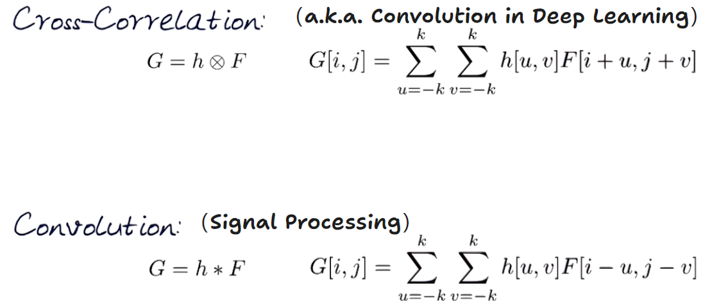
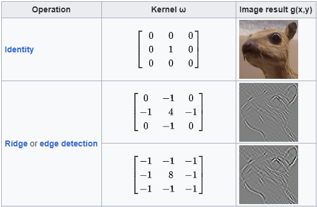
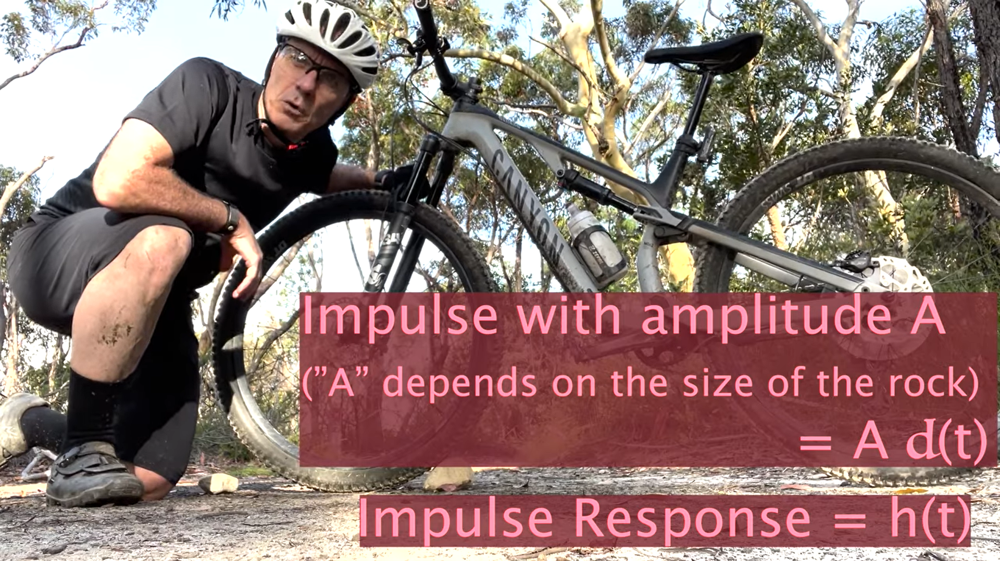
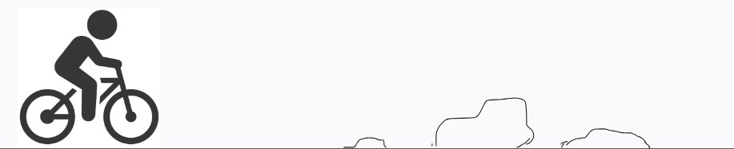
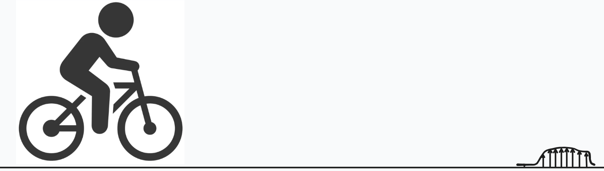
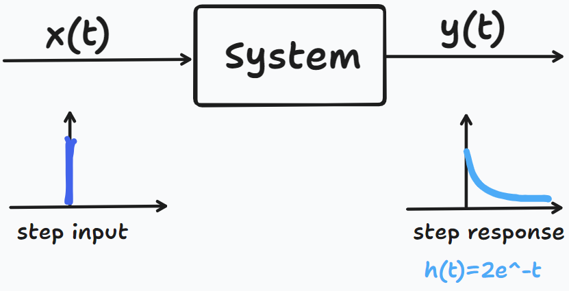
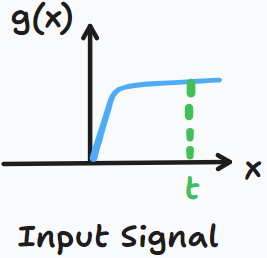
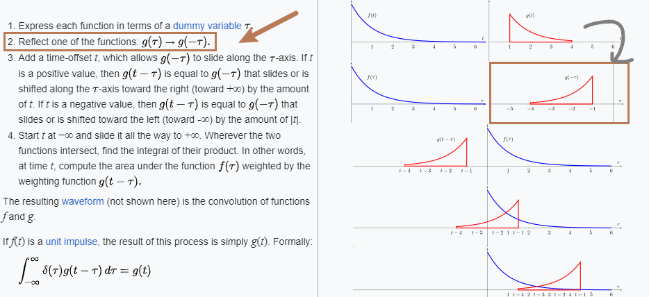

CNN 并没有用 卷积 (Convolution)
============================

> TL;DR: CNN uses cross-correlation, NOT convolution.

最近讲 CV Workshop 才意识到，原来 卷积神经网络 (CNN) 用的并不是 卷积 (Convolution)，实际上用的是 Cross-Correlation。

Convolutional Neural Network (CNN) 实际上是 Cross-Correlation Neural Network (CCNN)，可能大家习惯了，也懒得改了。

这篇文章会先介绍 Convolution 和 Cross-Correlation 的区别，为什么 深度学习 混淆了它们；接下来回到 信号处理，理解什么是 Convolution，为什么要计算 Convolution？公式右边的 **积分为什么是 $[0, t]$，以及积分项 $g(t - \tau )$ 为什么要翻转信号？**
$$ {f \ast g(t)= \int_{-\infty}^{\infty}f(\tau)g(t-\tau)d\tau}
f \ast g(t)= \int_{0}^{t}f(\tau)g(t-\tau)d\tau,\ \text{for}\ f, g \in [0, \infty)
$$

## 1 Convolution in Deep Learning

每当提到深度学习的卷积，很多人脑海里都会闪过这样一个小动画：

例如我们用一个 3x3 的 kernel 和一个图像做卷积，其实就是把这个 kernel 从左到右，从上到下扫过一张图片，然后对应位做乘法，最后相加求和就可以了：

然而如果我们细看这个方法，就会发现 **它其实并不是 Convolution (符号：$\ast$)，而是 Cross-Correlation (符号：$\otimes$)**：

$$
\begin{bmatrix}
a & b & c\\
d & e & f\\
g & h & i
\end{bmatrix}
\otimes
\begin{bmatrix}
1 & 2 & 3\\
4 & 5 & 6\\
7 & 8 & 9
\end{bmatrix}
= 
a·1 + b·2 + c·3 + d·4 +\ ...\ + h·8 + i·9
$$

实际上，真正的卷积应当是这样计算的：

$$
\begin{bmatrix}
a & b & c\\
d & e & f\\
g & h & i
\end{bmatrix}
\ast
\begin{bmatrix}
1 & 2 & 3\\
4 & 5 & 6\\
7 & 8 & 9
\end{bmatrix}
= 
a·9 + b·8 + c·7 + d·6 +\ ...\ + h·2 + i·1
$$

上面的公式是 element-wise 对应位相乘 (ax1, bx2, cx3 ...)，而下面的公式则是把矩阵 **先上下左右反转** 之后，再对应位相乘的 (ax9, bx8, cx7 ...)：
$$
\begin{bmatrix}
1 & 2 & 3\\4 & 5 & 6\\
7 & 8 & 9
\end{bmatrix}
\rightarrow
\begin{bmatrix}
9 & 8 & 7 \\
6 & 5 & 4 \\
3 & 2 & 1
\end{bmatrix}
$$
### 标准定义

如果我们用 $\omega$ 表示一个 $k \times k$ 的 kernel，用 $f(x, y)$ 表示输入图像，把这两种计算方式总结成公式，很容易就看出来区别了：
$$
\text{Cross-Correlation (深度学习误认为是卷积):\ } g(x, y)=\omega \otimes f(x,y)=\sum_{i=-k}^k{\omega(i,j)\  f(x+i, y+j)}
$$
$$
\text{Convolution (信号处理里定义的卷积):\ } g(x, y)=\omega \ast f(x,y)=\sum_{i=-k}^k{\omega(i,j)f(x-i, y-j)}
$$
上面 Cross-Correlation 是 $f(x+i, y+j)$，下面 Convolution 是 $f(x-i, y-j)$。

### 信号处理

如果你以前学过 信号处理 (Signal Processing)，可能恍然大悟，一个信号 $f(x)$ 和另一个信号 $g(x)$ 做卷积，我们需要 **先反转信号**，平移后再求积分：
$$
f \ast g(t)= \int_{-\infty}^{\infty}f(\tau)g(t-\tau)d\tau
$$
于是 前面离散的 $f(x-i, y-j)$ 和 这里连续信号 的 $g(t-\tau)$ 对应上了，它们才是真正的 卷积 $\ast$ 运算。

## 2 Convolution & Cross-Correlation

那么问题来了，为什么会犯这个错误呢？

最开始 Computer Vision 是把图像当作 2D 的信号处理的，所以借用了很多 Signal Processing 里的方法：

而在 Signal Processing 领域，很多 kernel filters 都是 **对称函数**，所以应用到 图像处理，很自然的用了 **对称矩阵**。

前面提到 Convolution 需要 上下左右反转矩阵，如果我们把上面的 对称矩阵 翻转会发现，还是原矩阵。

$$
\begin{bmatrix}
0 & -1 & 0\\-1 & 4 & -1\\
0 & -1 & 0
\end{bmatrix}
\rightarrow
\begin{bmatrix}
0 & -1 & 0\\-1 & 4 & -1\\
0 & -1 & 0
\end{bmatrix}
$$
**也就是说对一个 Symmetric Matrix 来讲，Convolution 和 Cross-Correlation 的计算结果是一样的，以至于 CNN 原作者可能没注意到两者的区别。**

然而，深度学习里的 CNN 训练出来的 kernel 通常并不是 Symmetric，所以 **CNN 计算的实际上是 Cross-Correlation，并不等同 Convolution**，不过 CNN 都叫好多年了，也就这样了，懒得改了。

## 3 什么是 Convolution？

那么更多问题又来了，到底什么是 Convolution 呢？为什么要计算 Convolution 呢？

一个很有意思的例子，一个 Professor 早上骑自行车锻炼身体的时候，突然灵感一现，开始介绍什么是 Convolution，我也终于理解了以前本科为什么要学 Step Response 处理这种现实并不 单独常见 的信号。

如果我们骑自行车经过一条小路，路上坑坑洼洼会有一些小石头：

那么当自行车经过这些石头的时候，挤压轮胎，轮胎就会变型。但自行车轮胎并不是瞬间变形，又瞬间恢复的：也就是说轮胎还没恢复，可能又轧到后面的石头，进一步变形，**最终轮胎的形变，是一系列石头压力的共同作用**。

所以我们很自然地可以把石头离散，一个连续的石头施加的力，被离散成一系列细小的力，最后求积分，而每一个细小的力产生的变形，就是 Step Response，比如轮胎的响应一开始会有一个大的形变，最后随着时间的推移慢慢消失 $h(t)=2e^{-t}$。

对于信号处理而言，路上的石头施加的力是 Input Signal $x(t)$，自行车就是 System，轮胎的变形则是 System Response $y(t)$，这样我们研究 Step Response 后积分，理论上就可以计算系统对任何信号的响应。

这个自行车轧过小石头的例子，就像 Convolution 一个信号扫过另一个信号，计算两个信号叠加面积的过程。

所以我们计算 Convolution 就是计算信号叠加的过程，如果我们知道系统的 Step Response $f(x)$，就可以计算系统对任意信号 $g(x)$ 的响应 $f \ast g(x)$。
$$
f \ast g(t)= \int_{-\infty}^{\infty}f(\tau)g(t-\tau)d\tau
$$

## 4 为什么计算 Convolution 要 翻转 信号？

首先，我们简化一下上面的公式。

实际的信号并不会从 $-\infty$ 持续到 $+\infty$，比如我们通常从 $t=0$ 开始施加一个信号，逐渐增加到某个值以后，信号强度就保持不变了。

这个时候我们在 $(-\infty, 0)$ 这段区间输入和输出都是 0，所以并不需要特意积分。
$$
f \ast g(t)= \int_{0}^{\infty}f(\tau)g(t-\tau)d\tau,\ \text{for}\ f, g \in [0, \infty)
$$
另一方面，如果我们关心的是到 $t$ 时刻两个信号叠加的结果，我们只用关心 $[0, t]$ 这段时间的信号叠加，因为未来的信号 $(t, +\infty)$并不会影响过去，这样就得到了最常见的 Convolution 积分形式：
$$
f \ast g(t)= \int_{0}^{t}f(\tau)g(t-\tau)d\tau,\ \text{for}\ f, g \in [0, \infty)
$$
**那么最后一个问题来了，也为什么积分项里面是 $f(\tau)g(t-\tau)$ 而不是 $f(\tau)g(\tau)$ 呢？**

不是两个信号叠加吗，怎么是输入信号 $g(\tau)$ **翻转** 成  $g(-\tau)$ ，再 **平移 $t$** 时刻，最后相乘积分 $g(t-\tau)$呢？

上面这张图可能是很多学 Signal Processing 的人牢记的公式，但是随着时间推移，却忘了为什么要翻转和平移信号。
$$
f \ast g(t)= \int_{0}^{t}f(\tau)g(t-\tau)d\tau,\ \text{for}\ f, g \in [0, \infty)=\int_{0}^{t}f(t-\tau)g(\tau)d\tau,\ \text{for}\ f, g \in [0, \infty)
$$
其实原因很简单，我们在 t 时刻的输入信号 $g(t)$，也会受到  $\tau=0，g(\tau)=g(0)$ 时刻的影响：比如 $\tau=0$ 时刻轮胎的变形，短时间可能没有恢复，过了 $t$ 时刻还会残留一些影响，而这滞后的影响就是 $f(t-\tau)=f(t-0)=f(t)$ ，所以我们积分的是 $f(t-\tau)g(\tau)=f(t)g(0)$。

## 总结

在一系列追根朔源的挖掘后，我终于理解为什么 CNN 把 Cross-Correlation 误当作了 Convolution，以及 Convolution 到底在计算什么，最后又是如何推导出经典的连续卷积公式：
$$
f \ast g(t)= \int_{0}^{t}f(\tau)g(t-\tau)d\tau,\ \text{for}\ f, g \in [0, \infty)
$$
这就是科研和讲课的乐趣，在给学生讲课的同时，逐渐补充了以前可能没有注意到的理论细节，对科研的深入也有很大帮助。