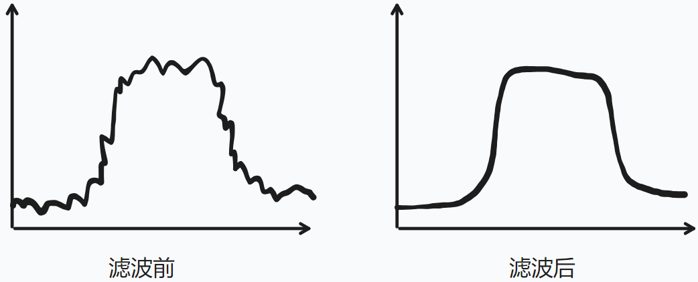

g-h 滤波器 与 PID 控制 (Filter & Control)
======================

之前的一篇文章介绍了 **[互补滤波器 (Complementary Filter)](https://doc.wuhanstudio.cc/posts/imu_filter.html)**，并演示了如何从 IMU 原始数据，用互补滤波器得到更准确的 加速度 和 旋转角速度 (核心算法的代码就 7 行)。

在理解了最简单的 互补滤波器后， 就可以进一步了解稍稍高级一点的 **g-h 滤波器**（也有人称为 alpha-beta 滤波器）。

> alpha-beta-gamma 滤波器 和 P I D 控制 高度相似。

当然，最受欢迎的滤波器当属 阿波罗 (Apollo) 登月计划闻名的 **卡尔曼滤波器 (Kalman Filter)**，但是要理解 Kalman Filter 需要一些理论背景，我会尝试从 互补滤波器，g-h Filter，再到 Bayesian Filter，循序渐进到 Kalman Filter 。

## 简介 滤波器 (Filter)

> 想起来还没介绍 什么是 滤波器 (Filter)？

每当提到滤波器，可能很多人脑海里就会有这样一张图：一条皱皱巴巴的曲线，在滤波后变得光滑。

虽然这个例子很形象地告诉我们：**各种传感器信号都是有噪声的，滤波器就是为了过滤掉这个噪声。**但是这个例子忽略了非常重要的两个概念：**预测 (Prediction) 和 观测 (Measurement)**，一个动态的过程。这两个概念可以说贯穿了 经典控制理论 以及 强化学习。

相比之下，我更喜欢另一个经典例子（不过我忘了这个例子的出处）。

假设你面前有两扇门 A B，一扇门是安全出口，而另一扇门的背后有一只老虎，你不得不选择一扇门离开。

然而很不幸，你提前没有任何信息，无法预测老虎在哪一扇门的背后，于是只能说每一扇门后面都有 50% 的概率是只老虎。(A: 50%，B：50%)

然而幸运的是，你有一双耳朵，可以偷偷听一听门背后的声音，并且你听到 A 出口后面传来了一声虎啸，这个时候你感觉 A 出口很危险。

然而不幸的是，两扇门太近了，耳朵也可能会听错，假如有 80% 概率听对，20% 的概率听错。在经过耳朵观测 (Measurement) 后，你更新了自己的 估计 (Prediction)，两扇门后有老虎的概率分别是 A: 80%，B: 20%。

生命只有一次，以防万一，你又偷听了一次，这次又听到 A 出口后传来吼叫声。

由于只有一个门后有老虎：假设老虎在A后面，两次听对的概率 0.8 * 0.8 = 0.64；假设老虎在B后面，两次听错的概率 0.2*0.2 = 0.04。

> 这里我们认为两扇门不互通，老虎不能随意移动，所以只有上面两种情况。不存在第一次听对，第二次听错（老虎一开始在 A，第二次跑去了 B）

这个时候你更新了自己的估计，两只门后有老虎的概率分别是：

- A：0.64 / (0.64 + 0.04) = 0.94
- B：0.04 / (0.64 + 0.04) = 0.06

两次观测后，这下你有 94% 的概率相信老虎在 A 后面了，于是大胆地从 B 出口离开了。

这个例子告诉我们 观测 (measurement) 的重要性，每一次偷听门后的声音，我们就对老虎的位置有了一个新的 估计 (Prediction)。滤波其实就是这样一个动态的过程：**在反复的观测中，不断更新自己的估计**。

但是现实世界的传感器都是不完美，有噪声的。比如你非常耳背，只有 60% 的概率能听对，有 40% 的概率会听错，这个时候如果你两次听到 A 门后传来了声音，你的估计是：

- A：0.36 / (0.36 + 0.16) = 0.69
- B：0.16 / (0.36 + 0.16) = 0.31

你可能就需要多观测几次，直到对当前的状态有一个比较准确的估计。

当然，这个例子过于简单，**我们假定了当前的状态是固定的**：老虎不会移动。一旦系统的状态会改变，例如我们预测气温的变化，一辆汽车的位置，就需要 g-h 滤波器 (Filter) 来动态地更新自己的估计了。

## g-h Filter

