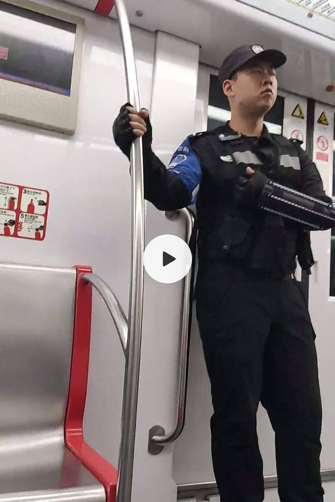
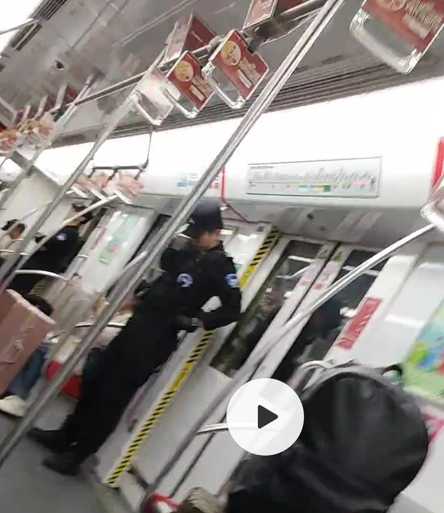
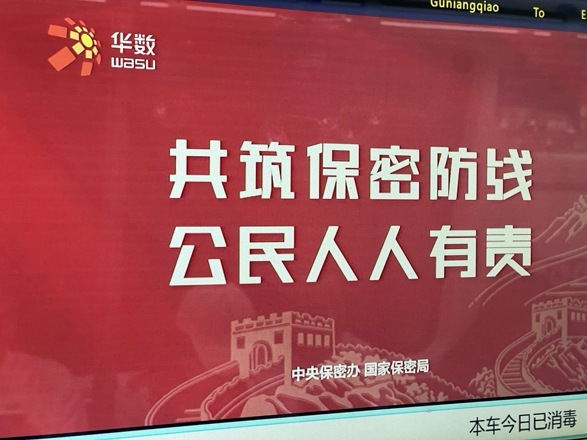
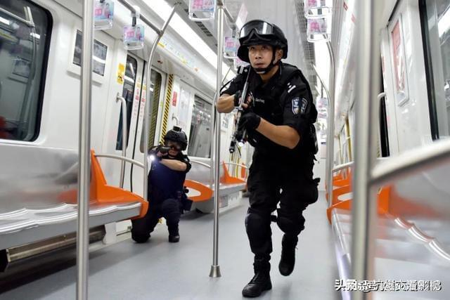
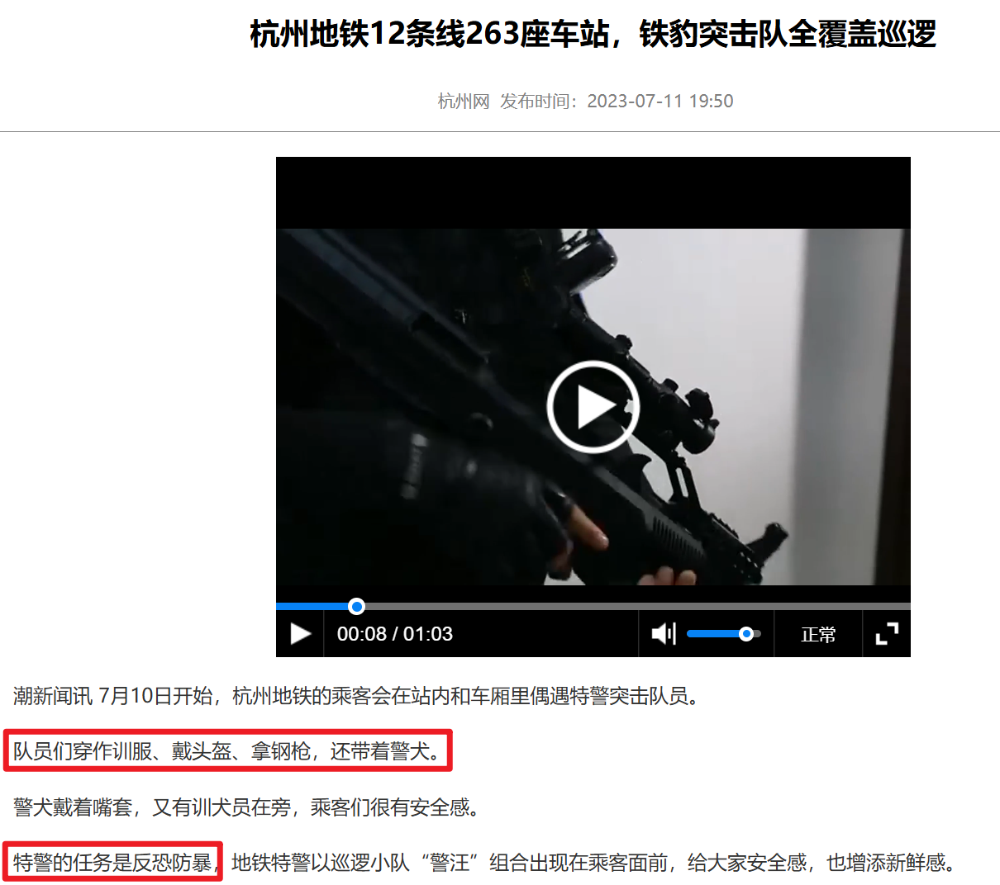
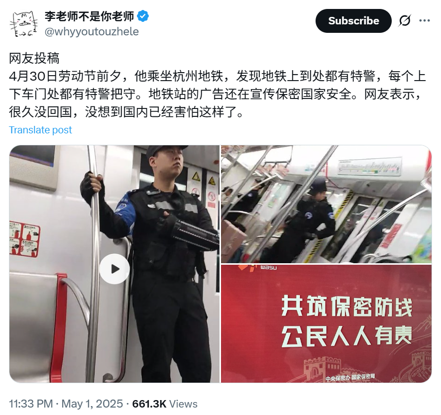

一张让杭州网警害怕的照片
==============

> 在杭州乘坐地铁，突然看见一群穿着训服、戴头盔、拿钢枪，还带着警犬的特警们，想必乘客们会觉得很有安全感吧，虽然不知道地铁上会出现什么，能让他们如此害怕。

接下来是我在杭州地铁1号线偶遇 铁豹突击队，却让国安、杭州网警惊心胆颤的故事。

## 杭州地铁 铁豹突击队

之前有一篇文章被接收了，于是 2025年4月底 去新加坡参加计算机顶会之一 ICLR，然而出发前不幸吃了英国中超 (Chinese Supermarket) 的过期食品，以至于在新加坡参会的时候一直在发烧。刚好带薪年假还有几天，于是决定先回国去杭州修养几天，身体恢复了再坐飞机回英国。

2025年4月29日深夜，顺利抵达杭州萧山国际机场，在附近随便住了一晚后，第二天下午乘坐杭州地铁1号线去预定的公寓，我很幸运地在地铁上偶遇了铁豹突击队，**看着特警凶狠的眼神、精良的装备，我的内心充满了安全感**。

虽然回国之前，就看到国内4月份几乎每天都有无差别砍人、撞人的新闻，但是看到地铁上密密麻麻的特警，多少还是有些震惊。从我拍的照片可以看到，一节车厢的每个门口都有特警把手，以至于一整列地铁从头到尾都是特警。

这些特警的手臂上蓝色的袖章上写着：**铁豹突击队**，他们手臂上的装备应该是专门防砍刀用的，胸前的口袋、肩上还挂着各种装备。

再配合着地铁车厢的宣传标语，有种如临大敌的感觉，虽然不知道他们的敌人究竟是谁？又有谁会携带国家机密坐地铁？地铁上的中国居民，也不明白这个 “公民” 指的又是谁，到底是谁的责任？

下了地铁后，我用 Google 搜索了一下 **铁豹突击队**，原来是之前亚运会的时候，专门全覆盖巡逻杭州地铁的特警，宣传片里面他们甚至在地铁上佩带手枪、肩上挂着步枪，地铁乘客们看到了一定觉得很安心吧。

- 下面新闻截自杭州网，杭州新闻中心

最后，我们一起来欣赏一下铁豹突击队的官方宣传片，他们精通格斗，枪法精准，装备精良，手枪、步枪、警棍、警犬、防爆盾，应有尽有。**在看宣传片之前，我都不知道坐地铁原来这么凶险。**

<video width="320" height="240" controls>
  <source src="https://wuhanstudio.nyc3.cdn.digitaloceanspaces.com/doc/hangzhou_ccp/swat.mp4" type="video/mp4">
</video>

于是，我把这个滑稽的场景发给了李老师，而这也迅速惊动了国安、网警，他们只用了一天就迅速锁定犯罪嫌疑人吴某，涉嫌从朝鲜境内擅自访问国际互联网，让世界看到了朝鲜精良的地铁安保，这显然是金将军不能忍受的。

## 杭州公安凌晨破门而入

