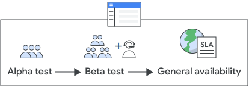
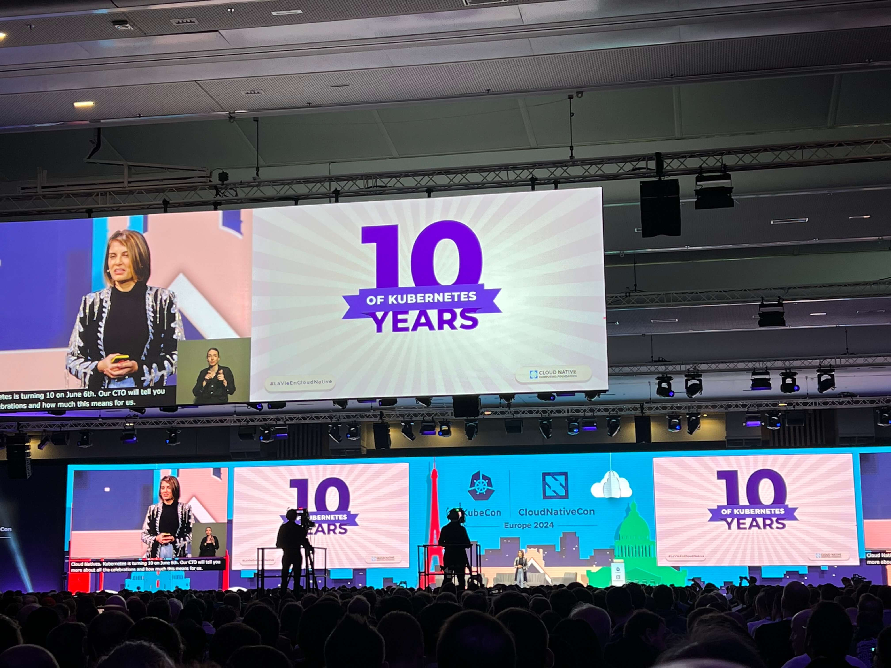

WASM / WASI - Kubecon 2024 (巴黎)
========================

> 2024 年是 Kubernetes (k8s) 十周年，于是上周特地去法国参加了 Kubecon 2024。

现场各个 Talk 中出现最频繁的三个词：WASM / Rust / AI，于是刚好借这个机会整理一下 WASM 离大规模应用还有多远。

之前一篇文章我总结了 [WASM 浏览器 / 云服务 / 嵌入式](https://doc.wuhanstudio.cc/posts/wasm.html) 各个领域的应用：

- WASM 在浏览器已经非常成熟，比如很多桌面应用都已经被移植到浏览器：Photoshop, AutoCAD，MatLab；
- WASM 的下一个目标则是 k8s 云服务，搭配 Rust 语言实现安全隔离的 Serverless 应用;
- WASM 嵌入式应用还很遥远，因为 WASI 标准 (I2C，SPI，Serial) 都还没制定，大概是下下个目标。

如果用软件开发的几个阶段来描述的话：

- WASM 浏览器已经是 General Availability 了;
- WASM 云服务正在从 Alpha 走向 Beta 阶段（当前发展重点 WASM + Rust）;
- WASM 嵌入式还在 pre-Alpha 阶段。




这里顺便一提，会场最后一个关键词 AI，其实我个人不太喜欢 AI 这个词，一开始大家说 AI 一般指 NLP 和 Generative Model (图灵测试)；后来整个 Deep Learning, Reinforcement Learning，Machine Learning 都变成 AI 了；再到现在，只要是 Optimization 相关的算法统统成了 AI，甚至连 A* 这种寻路算法也成了 AI。

这个套路以前我就见过：曾经传感器加个 MCU 就成了智能传感器，一下就能吸引更多人，拿到更多融资；现在一个公司没有 AI 相关，都不敢说自己是科技公司。这也导致了 AI 的范围越来越广，以至于现在听到 AI，我根本不知道对方具体指什么。

> - 你在做什么？我做 AI 的。
> - 你是哪里人？我是地球人。

实际上 Kubecon 会场的 AI，大部分用的是 Meta 开源的 Llama，因为从模型训练，Fine-tuning，到 Inference 和大规模部署，都有全套开源的工具链（国内所谓自主研发的大模型，基本都是 Llama）。

> 这大概是 AI 的另一个好处，如果直接说 Llama，自主研发就被戳破了，但是说 AI 就没人知道具体是什么了。

- Meta Llama：https://github.com/meta-llama/llama

接下来我会总结一下 WASM 云服务 和 嵌入式 比较受欢迎的几个项目。




## WASM 云服务

如果希望在云服务大规模部署 WASM 应用，我们需要一个 runtime，现在提到最多的三个：wasmtime, wasmer，WasmEdge。

- [wasmtime](https://github.com/bytecodealliance/wasmtime)：Bytecode Alliance 官方项目，各种语言支持比较全，开源贡献者最多；
- [wasmer](https://github.com/wasmerio/wasmer)：比较偏商业化的公司产品，各种语言支持也非常全；

- [WasmEdge](https://github.com/WasmEdge/WasmEdge)：也是一个商业化的产品，发展重点是轻量化，高性能。

接下是我个人的偏好：如果是想了解体验 wasm 最新的开源进度，我会选择 wasmtime；如果是公司商业应用，我会尝试 wasmer；而 WasmEdge 更多的是提供一种可能的轻量级优化方向。

当然，这些 runtime 都是被 [Docker 支持](https://docs.docker.com/desktop/wasm/) 的，也有一些略微小众一点的 runtime：

- `io.containerd.wasmer.v1`
- `io.containerd.wasmtime.v1`
- `io.containerd.wasmedge.v1`
- `io.containerd.lunatic.v1`
- `io.containerd.wws.v1`

- `io.containerd.slight.v1`
- `io.containerd.spin.v2`

如果使用 Docker，可以一行命令体验 wasm，不过这是 Docker Beta 才有的功能。

```
docker run \
  --runtime=io.containerd.wasmedge.v1 \
  --platform=wasi/wasm \
  secondstate/rust-example-hello
```


## WASM 嵌入式

对嵌入式而言，我只找到唯一的官方 runtime：[wasm-micro-runtime](https://github.com/bytecodealliance/wasm-micro-runtime)，现在支持的 RTOS 有：

-  [Zephyr](https://github.com/bytecodealliance/wasm-micro-runtime/blob/main/product-mini/README.md#zephyr), [RT-Thread](https://github.com/bytecodealliance/wasm-micro-runtime/blob/main/product-mini/README.md#RT-Thread), 
- [VxWorks](https://github.com/bytecodealliance/wasm-micro-runtime/blob/main/product-mini/README.md#vxworks), [NuttX](https://github.com/bytecodealliance/wasm-micro-runtime/blob/main/product-mini/README.md#nuttx)
- [ESP-IDF](https://github.com/bytecodealliance/wasm-micro-runtime/blob/main/product-mini/README.md#esp-idf)，[AliOS-Things](https://github.com/bytecodealliance/wasm-micro-runtime/blob/main/product-mini/README.md#alios-things)


## WASI

WASM 整体目标还是为了实现跨系统、跨硬件的代码，所以需要抽象很多 Interface，这些都是在 WASI 里面定义的。

从 WASI 的接口的进展，就能判断 WASM 距离应用还有多远 ：**一共有5个阶段，现在最为成熟的云服务也才到 Phase 3**：

- wasm-io
- wasm-filesyste
- wasm-socket
- wasm-http
- ...

另一个，**略微有些进展的方向是 神经网络 (Phase 2)**：

- [wasm-nn](https://github.com/WebAssembly/wasi-nn)

当然，**要说最不成熟的，那还得是 Phase 1 的嵌入式了**：

- wasi-i2c
- wasi-spi
- wasi-digital-io
- wasi-crypto
- wasi-native-threads
- wasi-message-queue

上面我列举的都是 嵌入式 最关心的接口了，但是都还处于画大饼阶段，所以我们还需要给 WASM 很多很多耐心。


### WASM Component

除了 WASI 标准，另一个很重要的是 [WASM component](https://component-model.bytecodealliance.org/design/why-component-model.html)。

为了增加 WASM 代码的可移植性，我们需要标准化一些接口调用的数据类型，这些接口需要用  WIT (Wasm Interface Type) 语言来定义，类似 ProtoBuf 的 proto 文件。

```
interface canvas {
    type canvas-id = u64;

    record point {
        x: u32,
        y: u32,
    }

    draw-line: func(canvas: canvas-id, from: point, to: point);
}
```

当然，如果写的 WASM 代码不遵循 WIT 标准，也是可以运行的，只不过这样可移植性大大降低地，需要反复造轮子。然而问题又在于，WIT 标准还在制定中，所以整体还有很长一段路要走。

最后关于 WASM 编程语言，Rust 毫无疑问是官方支持的第一梯队，其他的 Golang，Javascript，Python 只能说附带有支持。


## 总结

如果想知道 WASM 最新的发展阶段，可以在下面网站上看看自己关心的 WASI 接口到了什么阶段。

https://github.com/WebAssembly/WASI/blob/main/Proposals.md

当然，也可以参加 WASM 每双周的 meeting：

https://github.com/WebAssembly/meetings/blob/main/process/attendance.md