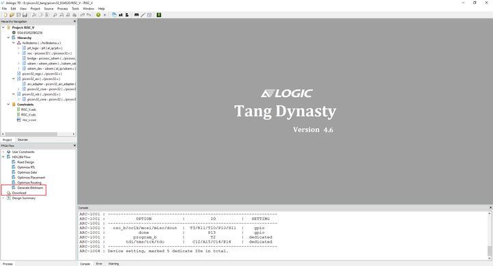

在 Picorv32 / 蜂鸟 E203 软核上运行 RT-Thread
=======================================

这篇文章主要介绍一下如何在2个FPGA软核上运行 RT-Thread。首先会介绍一下我用的 FPGA，接下来分别介绍在 蜂鸟 E203 和 picorv32 上运行 RT-Thread。

>  如果大家对如何在 FPGA 上造 CPU 感兴趣的话，Coursera 上有一门课 nand2tetris 挺有意思的，下面是2个链接分别是课程链接和在FPGA上的实现。

- https://www.coursera.org/learn/build-a-computer
- https://github.com/wuhanstudio/nand2tetris-iverilog

## 0. FPGA

首先介绍一下我用的 FPGA 开发板，也就是荔枝糖 (EG4S20)，这块开发板性价比应当算是很高了，100RMB有20K逻辑单元(LUT4/LUT5混合架构)，130KB SRAM，32bit 位宽 64MBit SDRAM，用来跑 RISC-V 的软核相当合适了。


添加图片注释，不超过 140 字（可选）


添加图片注释，不超过 140 字（可选）

为了给这块 FPGA 烧录 bitstream 把它变成软核，需要下载对应的IDE，下载链接在这里 http://dl.sipeed.com/。依次进入 Tang -> Premier -> IDE，下载最新的 TD Release 和最新的证书 Anlogic.lic，证书下载下来后替换安装路径 license 下的默认证书就可以正常使用了。

详细的安装步骤在这里也有介绍 http://tang.lichee.pro/

## 1. 蜂鸟E203

首先我们需要把FPGA变成一块RISC-V的开发板，因此需要烧录蜂鸟E203的bitstream，接下来就是把它当做单片机一样使用，上传固件了。

1.1 下载源码

为了方便，我把fpga的软核源码和RTT的固件源码放在了同一个仓库里。

```
$ git clone https://github.com/wuhanstudio/hbird_e203_tang
$ cd hbird_e203_tang
$ git submodule init
$ git submodule update
```

### 1.2 下载比特流

源码下载下来之后，Tang_E203_Mini 这个目录是软核的 Verilog 代码，hbird-sdk 则是蜂鸟E203的SDK。

接下来用 TD 软件打开源码 Tang_E203_Mini/project/e203egmini_new.al 下的项目，可以直接点 Generate Bitstream 生成比特流上传，当然上传之前也可以在左下角 User Constraints 里面检查一下引脚分配是对的。




添加图片注释，不超过 140 字（可选）

Bitstream 上传成功之后，这块 FPGA 开发板就是一个 RISC-V 单片机了，可以对照下面的引脚图把 JTAG 连接好，就可以上传 RT-Thread 固件了。


添加图片注释，不超过 140 字（可选）

### 1.3 上传固件

在编译上传之前，可以去芯来科技官网下载对应的 GCC 编译器和 OpenOCD，https://nucleisys.com/download.php，并且把他们安装在平级的目录下，比如:

```
nuclei/
--> gcc
--> openocd
```

详细的说明在蜂鸟 hbird-sdk 的官网也有介绍 https://doc.nucleisys.com/hbirdv2/quick_start/sdk.html。

工具链配置好之后我们就可以一步编译上传固件了：

```
$ cd hbird-sdk/application/rtthread/msh/
$ export NUCLEI_TOOL_ROOT=/opt/nuclei/             # replace with your path
$ export PATH=$NUCLEI_TOOL_ROOT/gcc/bin:$NUCLEI_TOOL_ROOT/openocd/bin:$PATH
$ make SOC=hbird BOARD=hbird_eval CORE=e203 upload
```

如果一切正常的话，按照上面的引脚图接好串口（和 FPGA 的引脚分配一致），就可以在控制台看到 RT-Thread 了：

```
\ | /
- RT -     Thread Operating System
 / | \     3.1.3 build Nov 25 2020  
2006 - 2019 Copyright by rt-thread team
Hello RT-Thread!
msh >
```

这样就成功在蜂鸟E203软核上运行 RT-Thread，具体的移植感兴趣也可以对照仓库代码详细看。

## 2. Picorv32

首先介绍一下 picorv32，它也是一个 Verilog 实现的开源 RISC-V 软核 https://github.com/cliffordwolf/picorv32

这里流程和蜂鸟E203略有区别，因为 picorv32 原版是没有 JTAG 接口的，所以在 EG4S32 的实现直接就把固件放在了 Verilog 实现的 ROM 里面，因此我们需要先编译固件，然后把固件融合在比特流里一起上传。

### 2.1 下载源码

同样我们先下载源码，为了方便起见，我依旧把FPGA和固件源码放在了同一个仓库里：

```
$ git clone https://github.com/wuhanstudio/picorv32_tang
$ cd picorv32_tang
$ git submodule init
$ git submodule update
```

如果大家不想自己编译工具链、编译固件，仓库里我也放了预编译好的固件，这样大家可以直接跳过 2.2, 2.3，直接去 2.4 最后一步。

### 2.2 编译固件

在编译固件前，我们需要 GCC 编译器，这里可以去下载编译好的工具链，也可以自己编译，编译大概需要 20min (i7-8665). 详细的编译流程在这篇文章里也有介绍 https://pingu98.wordpress.com/2019/04/08/how-to-build-your-own-cpu-from-scratch-inside-an-fpga/

```
$ sudo apt-get install autoconf automake autotools-dev curl libmpc-dev \
        libmpfr-dev libgmp-dev gawk build-essential bison flex texinfo \
    gperf libtool patchutils bc zlib1g-dev git libexpat1-dev

$ sudo mkdir /opt/riscv32i
$ sudo chown $USER /opt/riscv32i

$ git clone https://github.com/riscv/riscv-gnu-toolchain riscv-gnu-toolchain-rv32i
$ cd riscv-gnu-toolchain-rv32i
$ git checkout 411d134
$ git submodule update --init --recursive

$ mkdir build; cd build
$ ../configure --with-arch=rv32i --prefix=/opt/riscv32i
$ make -j$(nproc)
```

工具链准备好之后，我们就可以编译 RT-Thread 了。

```
$ cd rtthread-nano/rt-thread/bsp/picorv32_blink/
$ mkdir build & cd build
$ cmake ../
$ make
```

这里我们会生成 rt-thread.bin，但是这是没法直接被 FPGA 使用的，FPGA 的 ROM 初始化需要用到 Generate Memory Initialization File (MIF) 格式，因此我们下面需要转换一下格式。

### 2.3 生成 MIF 文件

这里我准备了一个 python 脚本方便直接把 bin 文件转换为 mif，顺便一提，这里的 ROM 大小是 32x8192 bit 也就是 32KB。

```
# Copy generated rt-thread.bin out.
$ cp rtthread-nano/rt-thread/bsp/picorv32_blink/build/rt-thread.bin bin2mif/
$ cd bin2mif

# Generate MIF
$ python3 bin2mif.py rt-thread.bin rt-thread.mif
```

这样我们就可以把编译生成的 rt-thread.mif 放到 FPGA 的项目里替换了。

```
$ cp bin2mif/rt-thread.mif picorv32_EG4S20/firmware/
```

### 2.4 上传比特流

我们用 TD 打开源码 picorv32_EG4S20/RISC_V/RISC_V.al 下的项目文件，就可以生成比特流了。


添加图片注释，不超过 140 字（可选）

这里大家可以看看 User Constraints 下面的引脚分配，接上串口不出意外就可以看到 RT-Thread 了：

```
\ | /
- RT -     Thread Operating System
 / | \     3.1.3 build Nov 25 2020
 2006 - 2019 Copyright by rt-thread team
Hello RT-Thread!
msh >
```

## 3. 项目链接

- picorv32 软核: https://github.com/wuhanstudio/picorv32_tang
- 蜂鸟 E203 软核: https://github.com/wuhanstudio/hbird_e203_tang

最后感谢 stupid_bird 前期做的工作，我也是在他的基础上进行了一些优化总结。

- https://gitee.com/Stupid_bird/picorv32_EG4S20
- https://github.com/RT-Thread/rtthread-nano/pull/4