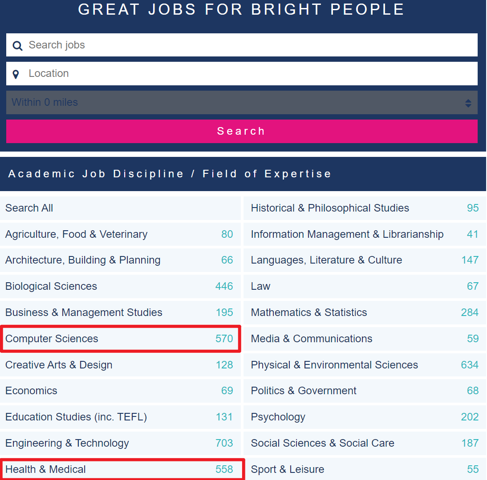
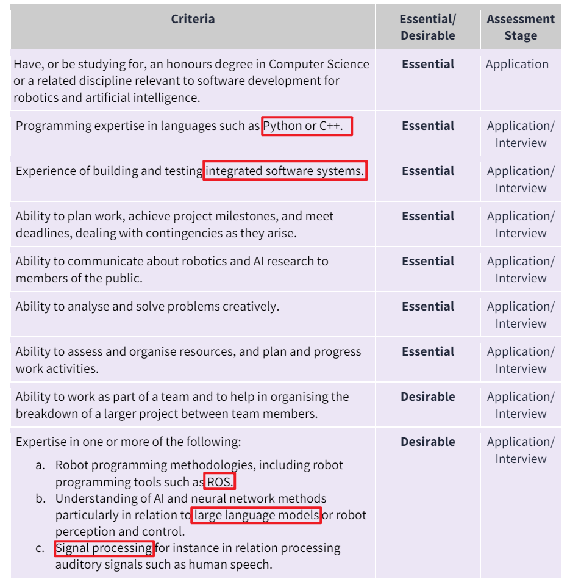

英国寻找博后的经历
==============

在 5 月份提交了 Ph.D. Thesis 后，刚好趁着 7 月份答辩之前，慢慢开始找博后，最近也开始收到 Interview，于是总结一下这一个月来找博后的经历。

英国找工作的特点之一就是工资标准非常明确，比如根据学历和工作经验，一般学术界对应的就是下面三档：

> Grade 6: Research Assistant £29,605 - £36,024 per annum (论文提交了，但还没有拿到博士学位);
> Grade 7: Research Associate £37,099 - £44,263 per annum（拿到博士学位以后）;
> Grade 8: Research Fellow £42,099 - £50,585 per annum （有几年经验，第二份博后）.

也就是说，没有博士学位可以申请 Research Assistant；拿到博士学位后升级为 Research Associate；有了几年博后的经验，就能升级为 Research Fellow，每升级一次，工资提升一个档次。并且除了伦敦的工资会明显高一点以外，其他地方不管是名校还是普通学校，工资水平几乎都是一样的，所以英国学术界不像国内那样有非常浓重的名校情结，毕竟 个人能力 和 工作经验 决定了级别之后，工资范围就定了。总体看来，有下面 3 条晋升路线：

> Research Assistant --> Research Associate --> Research Fellow
>
> Research Software Engineer --> Senior Research Software Engineer
>
> Lecturer --> Senior Lecturer

于是，刚毕业一般寻找的工作类型是： Research Assistant (博后)，Research Software Engineer (软件工程师) 和 Lecturer (讲师)，请不要刚毕业就申请 Senior 级别的工作。当然，如果要拿 **Global Talent Visa** 三年永居，通常找的是学术界的 Research Assistant 和 Lecturer；而 Research Software Engineer 很多时候面对工业界的人招聘，所以申请的签证是 **Skilled Worker Visa** 五年永居。

这里顺便一提，博士毕业是可以直接申请 Lecturer (讲师) 的，并不需要先做博后再申请讲师，而且英国申请 Lecturer 可能比博后还要容易，因为博后有全球的博士生竞争，而 Lecturer一般是打算留在英国的人才会申请，因为 Lecturer 的岗位很多都是 Permanent，而 Research Associate 通常是合同制 6个月 - 3年，项目结束就要重新找工作；另一方面，由于英国老师喜欢跳槽，经常会有 Lecturer 的岗位急缺人去给学生讲课。

>  但是我感觉科研还没有完全尽兴，所以打算先申请 Research Associate 和 Research Software Engineer。

## 博后岗位筛选

> 在筛选博后岗位的过程中，也会慢慢找到自己的兴趣所在，比如有的岗位虽然要求符合，但是我在投简历和面试的时候，发现自己提交申请的动力不是那么足，或者收到面试通知并没有那么开心，说明自己对这个研究方向并不是那么感兴趣。

英国的计算机博后岗位还算比较多，比如在 [jobs.ac.uk](https://jobs.ac.uk/) 上寻找学术界的岗位，岗位最多的专业要属 **计算机** 和 **医疗**，**每个月都会有 300-500 个岗位**。然而，计算机的很多博后岗位是和 医疗合作 (Biology，Healthcare)，所以整体看来，反而是 生物医学 的总体岗位数量更胜一筹。

虽然我发过 Interpretable ML 和医疗的文章，但是整体对 Efficient Deep Learning 更感兴趣，所以在筛选掉医疗 AI 相关的岗位后，**每个月就只剩下 60 个左右** Research Associate / Research Software Engineer 的岗位了 (Deep Learning , Computer Vision, Robotics, SciML HPC 相关)。

根据自己的研究兴趣，从几百个岗位，筛选到 60 个左右后，也不是所有的岗位都可以申请：**比如有的岗位规定 First Degree (本科) 必须是 Computer Science 或者 Robotics**，然而我本科是能源 (B.Eng.)，硕士热物理 (M.Sc.)，博士计算机 (Ph.D. in CS)，横跨 Engineering, Physics, Computer Science，所以这些对本科专业有要求的岗位也没法申请；当然，也有的岗位需要不同专业的背景，例如 Robotics 和 SciML。

最终，在筛选了几百个岗位后，每个月我真正感兴趣，有动力投简历的岗位只剩下十多个了，不过我也因此确定了自己真正感兴趣的方向：Efficient Embedded ML/DL, Scientific Computing (HPC)。

## 博后岗位申请

在找到自己感兴趣的岗位后，提交简历之前还需要确认自己满足 Job Description 里面所有的 Essential Criteria，只有满足所有 Essential 要求才有机会面试，而 Desirable 则是加分项。

至于在面试之前需不需要联系相应的老师，其实是取决于岗位的。如果是美国和瑞士是必须提前联系，比如瑞士只有导师推荐才能申请 Research Fellowship，提交申请，学院审核通过之后才能拿到博后岗位。但是在英国，大部分岗位是公开招聘竞争，所有申请人公开面试，所以不需要提前联系导师。

当然，凡事都有例外：比如有的岗位实验室内部已经有候选人了，但是根据学院要求必须公开招聘，这种我提交简历后就收到邮件，提醒我这个岗位已经有候选人了；另一种是，在招聘页面会有一句话：We strongly encourage interested candidates to contact xxx，这种当然需要提前联系。整体来讲，我没有联系过导师，也收到了面试，英国公开招聘和面试的机制，很大程度上还是保证了公平性。

至于申请材料，一般就是一封 Cover Letter 写明自己为什么对这个 position 感兴趣，并表明自己符合 Job Description 里面所有的要求，并附上个人 CV，申请材料其实非常简单。但是我也碰到过一些复杂的，比如有的岗位不光需要自己提交申请，还需要2个推荐人在截止日前提交推荐信。

## 签证问题 Visa

最后关于签证问题，特别是想拿英国永居，签证问题总需要认真考虑。

一般永居最常见的就是三条路：十年永居，五年工签，或者三年 Global Talent。

Global Talent Visa 虽然三年永居，但很多博后岗位合同只有1-2年，所以其实还是需要找到第二份博后，做满3年才能永居，如果找到2份2年的博后，其实还是得4年博后，除非一次性找到了 3-5 年的博后。另外，Global Talent 只针对学术界，比如 UKRI 资助的项目，如果去工业界也没法拿到 Global Talent，**适合对学术界有极大兴趣的人**。

Skilled Worker Visa 五年永居，则是 **针对工业界，而且对最低薪资有要求**，特别是最近几年最低薪资要求涨到了 £38,700 一年，甚至超过了一些博后岗位的工资，并且换工作后需要半年内找到新的工作，不然签证就失效需要离开英国，所以最近几年英国硕士想留在英国永居，难度可以说是非常大了。

Post Study Work Visa (PSW) 则是最保险的签证类型，博士毕业后可以无条件待在英国三年，不论有没有找到工作，但是 PSW 是没办法单独永居的，需要各种签证加在一起凑满 10年，例如 学生签证 四年，PSW 三年，工签/GTV 三年。

整体权衡下来，我更倾向于拿 PSW 在 学术界/工业界 自由穿梭、玩耍三年，最后再挑一个喜欢的地方，额外工作三年永居。总共需要6年永居，但是比较灵活，可以探索不同工作的乐趣，毕竟我对 AdvML / SciML (HPC)，嵌入式 / 云服务 都很感兴趣，有的在学术界，有的在工业界，灵活的 PSW 签证更能满足我的兴趣。