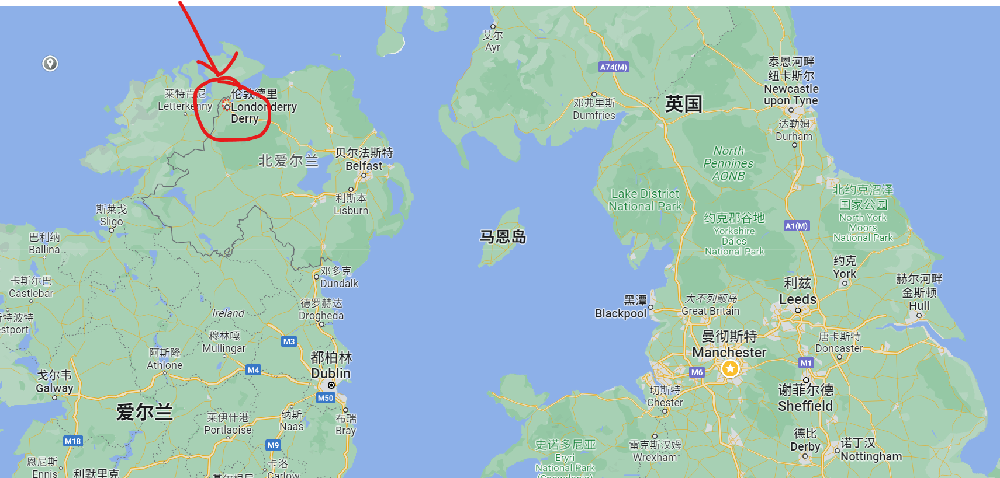
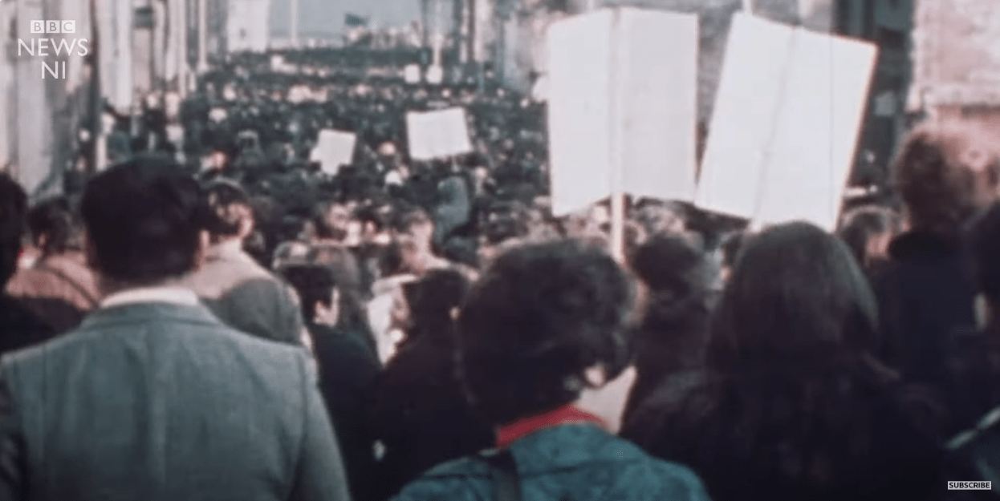

# Bloody Sunday

**时间**：1972年1月30号

**地点**：北爱尔兰 Derry

**起因**：

自 1960年代起，由于在公民选举中天主教信徒受到不公平待遇，例如参加选举需要额外的财产证明，或者不公正地划分选区 (Gerrymander)，他们成立了北爱尔兰公民协会 **Northern Ireland Civil Rights Association (NICRA)** 来争取自己的权力。

随后，NICRA 举办了大量的游行，让北爱尔兰政府非常头疼，于是政府在1971年8月9号宣布：不经过法院审判就可以拘留公民；随后又在1972 年1月18号宣布：1972年全年都禁止游行。这自然引来了 NICRA 的不满，四天后他们就再次举行游行，在一路前进到一个拘留营后，被驻守的士兵以橡胶子弹驱逐，双方爆发了武力冲突。

最终政府妥协，允许 NICRA 在1972年1月30号再次游行，不过只能按计划从 Bogside 游行到 Guildhall Square。

**经过**：

1972年1月30号下午2点45分，近1万到1万5千人按照 NICRA 的计划开始了游行，中途又有不少人加入。

然而游行队伍前进到市中心时，英国士兵用障碍物阻挡了人们的前进路线，企图修改游行路线；受到阻碍的人们开始强行冲破阻拦，而士兵则用橡胶子弹，催泪弹，和水枪压制。一部分游行的人们注意到高楼上也有士兵部署，开始向楼上仍石头。

下午3:55分，意外发生了，两个普通民众 Damien Donaghy 和 John Johnston 遭到枪击，开枪的士兵表示他们手中握着椭圆形物体，疑似手榴弹；于是士兵开枪，但是后续调查都表明市民手中并没有武器。

下午4:07分，士兵收到命令开始逮捕暴乱的民众，人们继续向士兵仍石头。由于距离太远，石头并不会对士兵造成生命威胁，然而士兵依旧开枪，**造成6人死亡**，7人受伤。随后人们开始逃离，一部分人们逃离至 Rossville Flats 附近的停车场，士兵开枪**造成 Jackie Duddy 死亡**，6人受伤。另一批人逃离至 Glenfada Park 附近的停车场，士兵开枪造成**2人死亡**，4人受伤。一部分士兵冲向 Southwest Corner，开枪**造成2人死亡**；另一部分士兵向 Southeast Corner 移动，**造成另外2人死亡**。

下午4:28分，救护车抵达，受伤的人们被送往医院或者附近的居民楼接受治疗。

**结果**：

当天游行，一共造成13人当场死亡，几十人受伤，另有一人4个月后伤口恶化死亡，没有士兵死亡。1972年2月2号，数万人参加了受害者的葬礼，爱尔兰全国哀悼，并且大面积罢工。

**审判**：

随后发生一系列针对政府的报复性恐怖活动，大量相关的文学作品，英语，电影被创作。

1992年英国首相 [John Major](https://en.wikipedia.org/wiki/John_Major "John Major") 决定重新公开调查 Bloody Sunday；1998年4月，调查委员会成立，花费7年多的时间调查了 900 多名目击者，花费超过1亿9500万英镑，最终在2010年公开了调查报告，并起诉了一系列军官：

Lieutenant Colonel Derek Wilford (指挥官)，Major Ted Loden，Captain Mike Jackson，Major General Robert Ford，Lance Corporal F（直接造成这5人死亡：James Wray，William McKinney，Michael Kelly, Patrick Doherty 和 Barney McGuigan），Colonel Maurice Tugwell，Colin Wallace（情报机关）。

**最终赔偿**：

- **John** "**Jackie**" **Duddy**, 17岁，赔偿 £75,000。

- **Michael Kelly**，17岁，赔偿 £75,000。

- **Hugh Gilmour**，17岁，赔偿 £75,000。

- **William Nash**，19岁，赔偿 £75,000。

- **John Young**，17岁，赔偿 £75,000。

- **Michael McDaid**, 20岁，赔偿 £75,000。

- **Kevin McElhinney**，17岁，赔偿 £75,000。

- **James** "**Jim**" **Wray**，22岁，赔偿 £75,000。

- **William McKinney**，26岁，赔偿 £75,000。

- **Gerard** "**Gerry**" **McKinney**，35岁，父亲，

- [**Gerard** "**Gerry**" **Donaghy**](https://en.wikipedia.org/wiki/Gerard_V._Donaghy "Gerard V. Donaghy")，17岁，儿子，母亲收到赔偿 £625,000

- **Patrick Doherty**，31岁，赔偿 £75,000。

- **Bernard** "**Barney**" **McGuigan**，41岁，赔偿 £75,000。

- **John Johnston**，59岁，赔偿 £75,000。

- 事件中受伤者有5人每人赔偿 £50,000，另外 Michael Quinn 脸部中弹，没有生命危险，收到赔偿 £193,000，根据受伤严重程度，每人收到不等的赔偿。

## 8964 天安门大屠杀

**时间**：1989年6月4号

**地点**：北京天安门广场

**起因**：

1989年4月15日，胡耀邦（前中共中央总书记）逝世，他在文革后积极倡导改革开放，经济飞速发展，人们终于从文革的阴影中走出来，不少民众自发走上街头悼念。由于胡耀邦开放清廉，而后上任的政府保守腐败，大家开始倡导打倒腐败，主张新闻自由，希望能继续在一个开放包容的环境下生活。

1989年4月26号，人民日报发表文章：必须旗帜鲜明地反对动乱（4-26社论）。当时的人民刚刚走出十年文革，迎来一个经济快速发展，言论自由的时代，无法接受自己倡议打倒腐败，主张新闻自由的行为被划定为动乱，全国大学生开始谴责4-26社论。

1989年4月27日，原本准备离开天安门的大学生被4-26社论激怒，北京几万名大学生再次走上街头。然而中央政府拒绝收回4-26社论，双方矛盾进一步加剧。

1989年5月4号，更多的大学生，工人，新闻记者，甚至政府机关的工作人员走上街头。随后中共总书记赵紫阳发表讲话，肯定了学生的爱国热情，并提倡通过协商对话解决问题。赵紫阳作为中央的温和派，他的讲话令学生感到安慰，部分学生逐渐离开广场。

1989年5月13号，由于政府并没有付诸实际行动，也没有积极与学生代表沟通，数百名学生开始在天安门广场绝食抗议，当地市民自发为学生送来水和食物。随后5月15日，苏联领导人戈尔巴乔夫访华，而天安门广场上仍然聚集着数万名市民。

1989年5月20日，北京政府宣布戒严，然而政府的强硬回应并没有打动学生，天安门广场数万人的抗议仍旧在继续。

**经过：**

1989年6月3号9点50分，北京市政府发出通告，要求市民待在家中，不要上街。

晚上10时16分时，由政府控制的扩音器警告说部队可以在实施戒严期间采取任何强制执行的措施，同时邓小平下令二十多万戒严部队向天安门广场进军，对沿途的学生和市民进行扫射。

1989年6月4号凌晨，坦克车开始驶入天安门广场，进行清场。

根据《中华人民共和国国务院公报》（1989年第11号）所提供资料，中国人民解放军军队、武警及警察有数十人被害，6,000多人负伤；非军人有3,000多人受伤，200余人死亡，包括36名大学生、医护人员、群众，并有1,103名－1,602名市民受到逮捕，实际死亡人数不清。

**结果**：

第二天，武汉、成都，西安，南京，广州，香港、澳门多地数百万人爆发抗议，声援北京的群众。尽管中宣部已要求媒体“噤声”，《人民日报》仍然在头版用花边框刊出《北京这一夜》一文，首先披露了戒严部队进城并开枪的消息。随后中共温和派，反对武力镇压的赵紫阳被免去所有职务，参加游行的人士受到追捕，流亡海外。

至今，每年的6月4号，全球都会举行大规模的纪念活动，而这一天在中国大陆则会禁止举办大型活动。

**审判**：

中国官方称此事件为**1989年春夏之交的政治风波**，并清空了相关的历史，国内所有8964相关的新闻遭到删除。在社交平台上相关的词汇被列为敏感词，人们开始用 “5月35日”、“VIIV”（“6”和“4”的[罗马数字]、“2^6”和“8平方”（82 = 64）等指代64事件。

**赔偿**：

参与游行的民众受到通缉、追捕，流亡海外。
